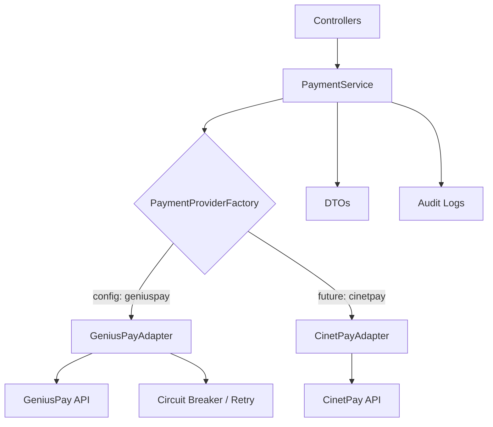

# Architecture Provider/Adapter Pattern — CotisPro Fintech

## Compréhension Confirmée

### Pattern Retenu : Provider/Adapter avec Service Layer



### Structure des fichiers créés

```
app/
├── Contracts/Payment/
│   ├── PaymentProviderInterface.php    # Contract principal
│   ├── PayoutProviderInterface.php     # Contract payout
│   └── MerchantQueryInterface.php      # Contract queries (balance, wallets, transactions)
├── DTOs/Payment/
│   ├── BalanceData.php                 # DTO solde marchand
│   ├── WalletData.php                  # DTO wallet
│   ├── PayoutRequest.php               # DTO request payout
│   ├── PayoutResult.php                # DTO result payout
│   ├── TransactionData.php             # DTO transaction
│   └── FeeCalculation.php              # DTO calcul frais
├── Services/Payment/
│   ├── PaymentProviderFactory.php      # Résolution du provider via config
│   ├── GeniusPayAdapter.php            # Adapter GeniusPay (implémente les 3 interfaces)
│   └── PaymentService.php             # Service layer métier (orchestration)
└── Http/Controllers/Api/
    └── AdminMerchantController.php     # TÂCHE 1: endpoints admin dashboard
```

### Endpoints GeniusPay Mappés

| Endpoint API | Interface | Méthode |
|---|---|---|
| `GET /merchant/account/balance` | `MerchantQueryInterface` | `getBalance()` |
| `GET /merchant/wallets` | `MerchantQueryInterface` | `getWallets()` |
| `GET /merchant/payments/{ref}` | `MerchantQueryInterface` | `getTransaction(ref)` |
| `GET /merchant/payouts` | `MerchantQueryInterface` | `listPayouts(filters)` |
| `GET /merchant/payouts/{ref}` | `MerchantQueryInterface` | `getPayoutDetails(ref)` |
| `POST /merchant/payouts` | `PayoutProviderInterface` | `executePayout(request)` |
| `POST /merchant/payments` | `PaymentProviderInterface` | `initiatePayment(...)` |

### Règles de Calcul des Frais (centralisées backend)

```
Frais GeniusPay = Montant Brut × 0.015 (1.5%)
Commission Plateforme = Montant Brut × 0.005 (0.5%)
Net reçu sur Wave = Montant Brut - (Frais GeniusPay + Commission Plateforme)
```

## Statut

- [x] Architecture (Interfaces + DTOs + Adapter + Factory + Service)
- [x] TÂCHE 1 — Dashboard Admin (backend + frontend)
- [x] TÂCHE 2 — Payout Instantané (PayoutService + CaisseController + RetraitWaveModal)
- [x] TÂCHE 3 — Calcul Frais Temps Réel (FeeCalculation DTO + endpoint + UI debounce)
- [x] TÂCHE 4 — UX Anti-Support (confirmation inratable + tooltips + erreurs pédagogiques)
- [x] TÂCHE 5 — Monitoring Admin (table paginée + filtres + détails read-only)
- [x] TÂCHE 6 — Solde Groupes (calcul ledger infaillible + vue admin)
- [x] TÂCHE 9 — Webhook Handler (payout.completed + payout.failed + restitution)
